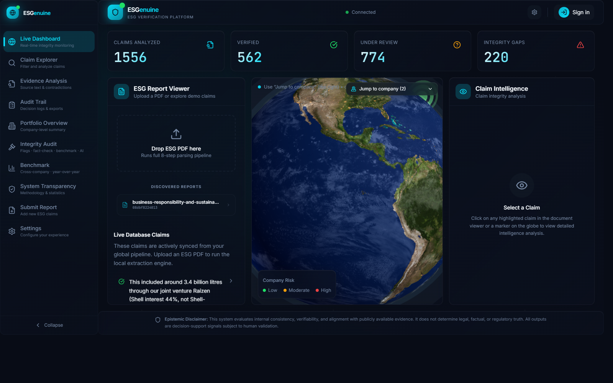
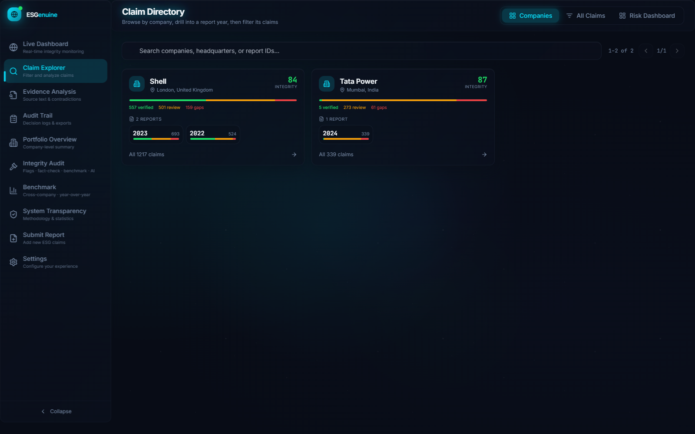
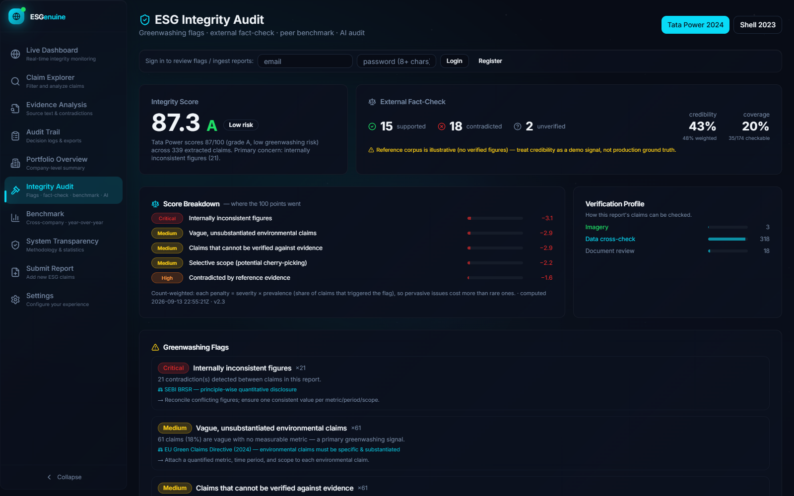
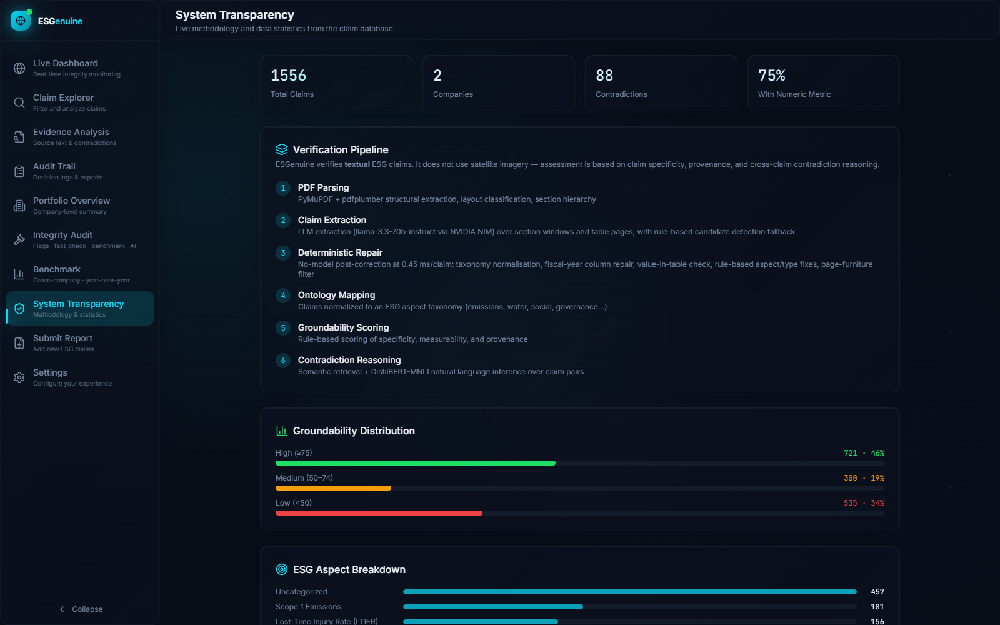
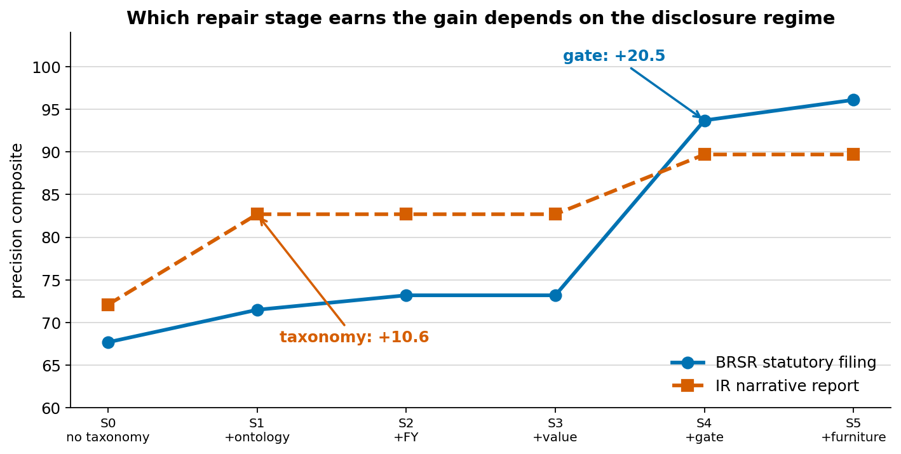
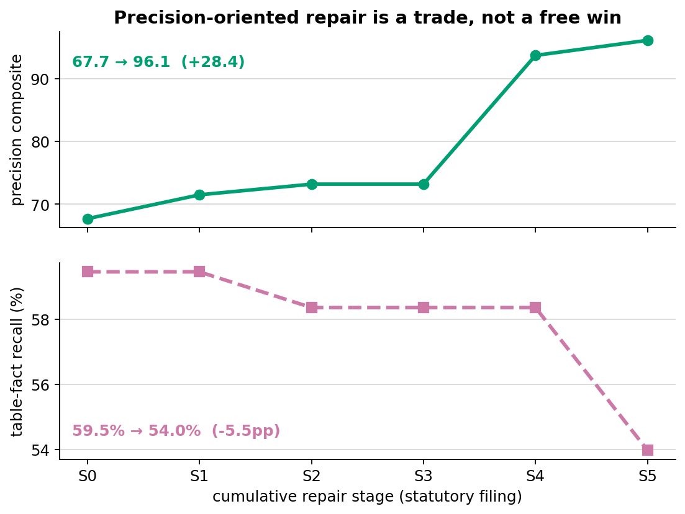
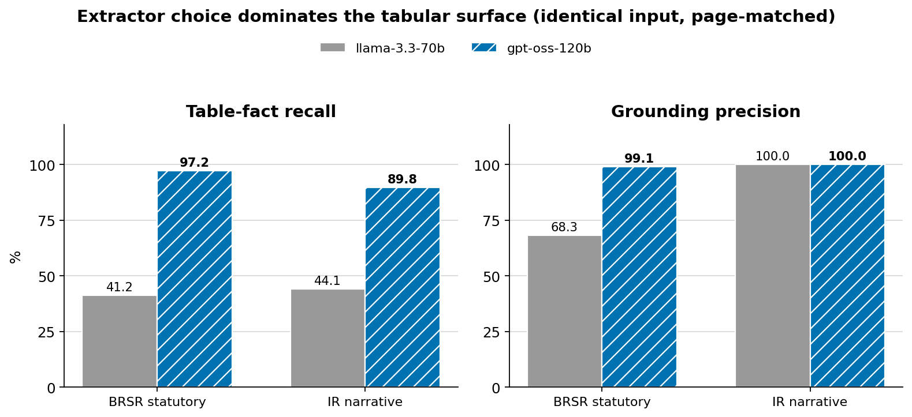

# ESGenuine

[](https://github.com/iamnishaant/ESGenuine/actions/workflows/ci.yml)
[](LICENSE)


> Corporate sustainability reports are written to be read by humans and audited by nobody. This makes them machine-checkable.

An **evidence-grounded ESG claim extraction and integrity system**. It turns a 90-page
sustainability PDF into structured, provenance-carrying claims, then measures how much of
that extraction you can actually trust — with a deterministic post-correction layer that
repairs what the language model gets wrong at **0.45 ms per claim and zero inference cost**.

Unlike typical LLM document pipelines, this system:

- **Measures itself.** Eight evaluation harnesses, bootstrap confidence intervals, a
  mechanically-enumerated recall denominator, and a CI gate that fails the build if ground
  truth is edited.
- **Refuses to flatter itself.** Circular metrics are suppressed, thin-sample scores are
  withheld rather than printed, and the harnesses decline to emit an interaction term when
  the experimental arms aren't comparable.
- **Recomputes offline.** Every number below regenerates from committed fixtures in
  seconds, with no API key and no network.

| | |
|---|---|
| 🎤 **Presentation** | [`docs/presentation/ESGenuine_presentation.pptx`](docs/presentation/ESGenuine_presentation.pptx) — 13 slides with speaker notes |
| 📘 **Full end-to-end trace** | [`conclusion/EXACT_FLOW.md`](conclusion/EXACT_FLOW.md) — every stage, threshold and decision rule, with file:line references |
| 🔍 **Repository audit** | [`conclusion/AUDIT.md`](conclusion/AUDIT.md) — feature-by-feature status, defects, and scores |
| 📄 **Paper draft** | [`docs/paper/`](docs/paper/) — LaTeX source, bibliography and figures |

---

## 🧭 TL;DR

- **Problem:** ESG disclosures are unstructured, unverified, and inconsistent between
  documents — and LLM extraction from them fails quietly.
- **Solution:** Parse → extract → **deterministically repair** → ground against the source
  page → store with provenance.
- **Core finding:** The repair layer is *post-hoc, rule-based and free*, and **which
  repair matters is determined by the disclosure format** — a statutory filing and a
  narrative report need different corrections.
- **Impact (all measured, see [Results](#-results)):**
  - Precision composite **67.7 → 96.1** (statutory), **72.1 → 89.7** (narrative)
  - Repair layer worth **+24.6** and **+7.0** points at **zero LLM cost**
  - **0.45 ms/claim** — 168 ms for a 373-claim report, single-threaded, no network

---

## 🖥️ The dashboard

<p align="center">
  
  
  
  
</p>

Live dashboard · claim explorer · integrity audit · system transparency — running on a
demo database rebuilt from the claims committed to this repository (Tata Power BRSR FY24,
Shell 2022 and 2023; 1,556 claims, 88 contradictions). See [Quick Start](#️-quick-start).

---

## 🎯 Problem Statement

- **Unstructured disclosure.** The same metric appears as a table cell in one report, a
  sentence in another, and a footnote in a third. There is no schema.
- **Silent LLM failure.** An extractor asked for "Scope 1 emissions" returns a number that
  looks plausible. We measure **31.7%** of a 70B model's emitted values as *not present on
  the page it cites*.
- **Unfalsifiable evaluation.** Most pipelines report a precision figure against a gold set
  sampled from their own output — which structurally cannot count what they missed.

This leads to ESG ratings that **disagree with each other** at correlation ~0.54 across six
major providers (Berg, Kölbel & Rigobon, 2022), and to greenwashing that is **invisible to
automation**: a target restated three ways across two reports reads as three supporting
claims, not one unverified commitment.

---

## 💡 Key Contributions

1. **Deterministic post-correction layer** — five cumulative stages (taxonomy
   normalisation, fiscal-year column repair, source-value verification, rule-based gate,
   furniture filter) applied *after* the LLM. Worth +24.6 points on a statutory filing at
   no inference cost.
2. **Regime-dependent repair — the central finding.** The dominant repair differs by
   disclosure format: the rule-based gate carries the statutory filing (**+20.5**), taxonomy
   mapping carries the narrative report (**+10.6**), and **the two confidence intervals do
   not overlap**.
3. **Mechanically-grounded evaluation, not self-report.** Recall is measured against table
   cells *enumerated from the parsed document*, giving a system-independent denominator.
   Grounding precision checks whether an emitted number literally occurs on its cited
   page — no annotation, comparable across any system.
4. **Adversarial harness design.** The rule-based baseline is built from the same
   enumerator that scores recall, so its 100% would be tautological — the harness detects
   this and prints `--` instead. Gold scores computed on a <50% sample match render as
   `n/a`, not as a number.

---

## 🏗️ System Architecture

```text
             PDF (sustainability / BRSR / ESG report)
                              │
                    ┌─────────▼──────────┐
                    │  Parsing (Docling)  │  triage → layout → sections →
                    │  + table extraction │  sentences → candidates → tables
                    └─────────┬──────────┘
                              │  page markdown + semantic chunks
                    ┌─────────▼──────────┐
                    │  LLM extraction     │  llama-3.3-70b via NVIDIA NIM
                    │  (pooled, N keys)   │  round-robin + failure cooldown + checkpoint
                    └─────────┬──────────┘
                              │  raw claims (aspect, metric, provenance)
        ┌─────────────────────▼─────────────────────┐
        │      DETERMINISTIC REPAIR LAYER            │   ← the contribution
        │  S1 taxonomy → S2 FY repair → S3 value-in- │      0.45 ms/claim
        │  table → S4 rule-based gate → S5 furniture │      zero API cost
        └─────────────────────┬─────────────────────┘
                              │  repaired + flagged claims
                    ┌─────────▼──────────┐
                    │  Supabase Postgres  │  pgvector HNSW, LIST partitions,
                    │  + embeddings       │  content-hash dedup, idempotent ingest
                    └─────────┬──────────┘
                              │
      ┌───────────────────────┼───────────────────────┐
      ▼                       ▼                       ▼
 Contradiction          Greenwashing            Integrity report
 (NLI, DistilBERT)      taxonomy                (count-weighted score)
      │                       │                       │
      └───────────────────────┼───────────────────────┘
                              ▼
                   React + Vite dashboard
        (portfolio globe, claim explorer, integrity audit, audit trail)
```

### Components

| Component | Where | What it does |
|---|---|---|
| Parsing | `backend/src/parsers/` | PDF → sections, sentences, claim candidates, structured tables. A triage step rejects non-machine-readable PDFs with a 422 instead of producing silent garbage. |
| LLM extraction | `backend/src/extractors/claim_extractor.py` | Text windows and table pages → structured claims, through a round-robin key pool with per-key cooldown, bounded retry and a **resumable checkpoint**. |
| Deterministic repair | `backend/src/extractors/quality_gate.py`, `ontology.py` | Taxonomy normalisation (51 nodes, 7 pillars); fiscal-year column repair; value-in-table verification; ~40 rule-based repairs; form-furniture removal. |
| Storage | `backend/src/extractors/supabase_ingest.py` | Idempotent, content-hash-deduplicated ingest; `bge-base-en-v1.5` embeddings pinned by commit SHA. |
| Reasoning | `backend/src/reasoning/` | NLI contradictions, greenwashing-signal taxonomy, fact-checks, document integrity score. ⚠️ Not evaluated — see [Limitations](#️-limitations--what-is-not-evaluated). |
| Dashboard | `frontend/src/` | Portfolio globe, claim explorer with page provenance, integrity audit, benchmark, audit trail, system transparency. |

### Models

| Role | Model | Pinning |
|---|---|---|
| Claim extraction | `meta/llama-3.3-70b-instruct` (NVIDIA NIM) | hosted, temperature 0.1 |
| Comparison arm | `openai/gpt-oss-120b` (NVIDIA NIM) | hosted, temperature 0.1 |
| Embeddings | `bge-base-en-v1.5` | commit `a5beb1e3` |
| Contradiction (NLI) | `distilbert-base-uncased-mnli` | commit `cfa538a0` |

**There is no training.** This is an extraction-and-repair system, not a learned model. All
RNGs are seeded (42) and local weights are pinned by commit SHA, so the offline results are
bit-reproducible.

---

## 📊 Results

> Every figure is rendered by `backend/scripts/make_readme_figures.py`, which computes its
> values from the committed fixtures **at render time** — a plot cannot drift from the
> table beside it.

### Corpus

| | |
|---|---|
| Companies / reports | **4 / 6** (Tata Power, Shell, Infosys, Microsoft) |
| Source pages | **461** |
| Extracted claims | **1,730** (1,394 carrying a numeric value) |
| Annotated claims | 100 (2 × 50) |
| Disclosure regimes | 1 statutory BRSR filing, 5 narrative/IR reports |

### 1. Which repair matters depends on the report



The dominant repair stage is set by the disclosure format — the rule-based gate carries the
statutory filing (**+20.5** [16.3, 25.2]), taxonomy mapping carries the narrative report
(**+10.6** [7.8, 13.5]), **and the intervals do not overlap**. A single pipeline tuned on
one regime will under-serve the other.

| Δ (paired bootstrap, 95% CI) | BRSR statutory | IR narrative |
|---|:--:|:--:|
| S0→S1 taxonomy | +3.8 [1.5, 6.5] | **+10.6** [7.8, 13.5] |
| S3→S4 gate | **+20.5** [16.3, 25.2] | +7.0 [4.0, 10.2] |
| S4→S5 furniture | +2.4 [0.8, 4.3] | +0.0 *n.s.* |
| **S1→S5 repair layer** | **+24.6** [19.6, 30.4] | **+7.0** [4.0, 10.2] |

Per-field accuracy of the shipped configuration (nonparametric bootstrap, 2,000 resamples):

| Metric | BRSR statutory | 95% CI | IR narrative | 95% CI |
|---|--:|:--:|--:|:--:|
| candidate precision | 86.0% | [75.0, 95.5] | 98.0% | [94.0, 100.0] |
| aspect node | 94.6% | [85.7, 100.0] | 79.6% | [68.0, 90.0] |
| unit family | † | — | 77.3% | [64.4, 89.1] |
| claim type | † | — | 95.9% | [89.8, 100.0] |
| **precision composite** | **96.1** | **[93.5, 98.5]** | **89.7** | **[85.3, 94.0]** |

† No errors observed in the annotated sample — reported this way rather than as 100%,
because a percentile bootstrap on all-correct data returns a degenerate interval.

### 2. What precision costs



Across S0→S5 the composite rises **67.7 → 96.1** while table-fact recall **falls
59.5% → 54.0%**. The furniture filter removes 34 claims, and some of them are genuine facts.
**A precision-only evaluation cannot see this.** Recall is measured against 482 table cells
enumerated mechanically from the parsed document — a denominator the system does not control.

### 3. Extractor choice vs. repair — a matched comparison



Identical committed markdown, identical code path, identical token budget; only the model
differs. Page-matched, so a page lost to a network failure cannot read as a model finding
nothing.

| Document | Extractor | Fact recall | Grounding |
|---|---|--:|--:|
| BRSR | llama-3.3-70b | 41.2% | 68.3% |
| BRSR | **gpt-oss-120b** | **97.2%** | **99.1%** |
| IR | llama-3.3-70b | 44.1% | 100% |
| IR | **gpt-oss-120b** | **89.8%** | 100% |

**31.7%** of the 70B model's emitted values do not occur on the page they cite, against
**0.9%** for the 120B model — the exact misattribution class the source-value check exists
to catch.

> ⚠️ **This comparison does *not* establish whether the repair layer survives a model
> upgrade, and we do not claim that it does.** Recall and grounding observe the layer only
> where it adds, removes or rewrites a claim, and its one such action removes nothing at
> either tier. The gate's intervention rate *rises* with the stronger model
> (15.4% → 37.7%) — which rules out the convenient conclusion without settling the question.
> See [`docs/CROSSCHECK_FINDINGS.md`](docs/CROSSCHECK_FINDINGS.md).

### 4. Cost, and the no-model floor

| | |
|---|--:|
| Repair layer | **0.45 ms/claim** (168 ms for 373 claims, single-threaded) |
| Rule-based extraction, no LLM | names only **43.1%** of table rows |

The 57% of table rows a keyword taxonomy *cannot* name is the share of the surface that
genuinely requires a model.

---

## ⚠️ Limitations — what is *not* evaluated

Stating these is what makes the rest credible.

1. **Development sets, not held-out.** Both annotated sets were tuned against; 6 of 100
   labels were revised toward the system. **No untouched test set exists.** The paired
   ablation deltas are unaffected (identical claims at both stages), which is why they are
   the primary result and the absolute scores are context.
2. **Single annotator.** No inter-annotator agreement statistic.
3. **Precision-only composite.** No recall term; narrative-claim recall is unmeasured.
4. **Two documents in depth**, and they are the corpus's *easiest* — 23–25% of their claims
   fall outside the taxonomy, against 52–53% for two reports not evaluated.
5. **The frozen fixtures are not raw model output.** They carry repair flags from an earlier
   layer revision, so S0 is a *reconstruction* and the reported gains are a **lower bound**.
6. **Extraction is not end-to-end reproducible** — hosted LLM at non-zero temperature.
   Frozen fixtures make every *reported* number recomputable.
7. **Out of scope and unevaluated:** contradiction detection, the greenwashing taxonomy, the
   document integrity score (severity weights are hand-set and uncalibrated), and satellite
   verification. These ship as components; **no accuracy is claimed for any of them.**

---

## ⚙️ Quick Start

**Windows, one command** — runs the API on `:8000` and the dashboard on `:8080` in one
console:

```bat
start.bat
```

**Manually:**

```bash
# 1. Backend environment (Python 3.12)
python -m venv .venv
.venv\Scripts\python -m pip install -r backend/requirements.txt -r backend/requirements-dev.txt

# 2. Verify the evaluation reproduces — no keys, no network
cd backend && ..\.venv\Scripts\python -m pytest -m "not live" && cd ..

# 3. Configure: copy .env.example to .env and fill in the Supabase values
#    (VITE_SUPABASE_URL / VITE_SUPABASE_PUBLISHABLE_KEY are enough for the dashboard)

# 3b. Empty Supabase project? Create the schema, then load the committed claims — no LLM
#     calls, a few minutes (needs DATABASE_URL and SUPABASE_SERVICE_ROLE_KEY in .env)
.venv\Scripts\python backend/scripts/bootstrap_db.py
.venv\Scripts\python backend/scripts/load_committed_claims.py

# 4. Run
cd backend && ..\.venv\Scripts\python -m uvicorn src.api.server:app --port 8000   # API
cd frontend && npm install && npm run dev                                          # dashboard, new terminal
```

### Reproduce every number (offline, seconds)

```bash
python backend/scripts/run_ablation.py   --markdown   # repair-layer ablation
python backend/scripts/run_bootstrap.py  --markdown   # confidence intervals
python backend/scripts/run_recall.py                  # table-fact recall
python backend/scripts/run_baselines.py  --markdown   # 2×2 + no-LLM floor
python backend/scripts/run_cost.py       --markdown   # latency
python backend/scripts/run_page_matched.py            # page-matched model comparison
python backend/scripts/run_gate_workload.py           # gate intervention rate
python backend/scripts/make_readme_figures.py         # the plots above
```

Raw LLM outputs and parsed page markdown are committed as frozen fixtures; local weights are
pinned by commit SHA; all RNGs seeded. **A gold-set tamper gate fails CI if any ground-truth
label changes without a documented version bump.**

### Example: ingest a report

```bash
curl -X POST http://localhost:8000/v1/reports/ingest \
  -F "file=@report.pdf" -F "company_name=Tata Power" -F "report_year=2024"
# → { "job_id": "..." }   then poll GET /v1/jobs/{job_id}
```

**Example claim:**

```json
{
  "aspect": "renewable energy share",
  "normalized_aspect": "energy.renewable",
  "metric": { "value": 42.5, "unit": "%" },
  "claim_type": "performance",
  "provenance": { "page_number": 17, "source_sentence": "Renewable capacity (%)" },
  "framework_tags": ["GRI 302-1"],
  "quality_flags": ["type_fixed"]
}
```

---

## 📁 Repository Structure

```text
backend/
├── src/
│   ├── parsers/          Docling PDF → sections/sentences/tables
│   ├── extractors/       LLM extraction, ontology, quality gate
│   ├── reasoning/        NLI contradictions, greenwashing, integrity
│   ├── verification/     geocoding + Sentinel-2 NDVI satellite checks
│   └── api/              FastAPI: ingest, claims, jobs, auth
├── scripts/              evaluation harnesses (the science)
├── tests/                offline test suite
│   └── eval/             gold sets, frozen fixtures, hash locks
└── database/             schema + migrations (partitions, RLS, HNSW)
frontend/src/             React + Vite dashboard
conclusion/               project report, end-to-end trace, audit, figures
docs/
├── presentation/         slide deck
├── paper/                LaTeX paper source
├── results/              generated result tables
└── dev-notes/            development logs and working notes
```

---

## 🌍 Impact & Vision

- **For analysts:** a claim store with page-level provenance, so a number can be traced to
  the sentence that produced it.
- **For researchers:** a fully offline, reproducible evaluation harness for ESG claim
  extraction — including the negative results.
- **Vision:** make sustainability disclosure *falsifiable* — every claim carries the evidence
  that supports it, and the measurement of how much that evidence is worth.

---

## 👥 Contributors

Ansh Bajpai · Nishant Shah

## 📄 License & Citation

MIT — see [`LICENSE`](LICENSE). If you use this work, see [`CITATION.cff`](CITATION.cff).
